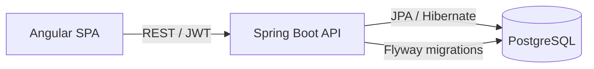

# FinTrack

> Personal finance tracker — a full-stack reference application built with **Spring Boot 3** and **Angular**.


FinTrack lets a user track income and expenses across multiple accounts, organise them by
category, set monthly budgets, and visualise where the money goes. It is built as a clean,
production-shaped codebase: stateless JWT auth, a migrated relational schema, validation,
pagination, automated tests and CI.

---

## Features

- 🔐 **JWT authentication** — register / login, stateless `Bearer` tokens, BCrypt password hashing
- 🏦 **Accounts** — checking, savings, wallet, credit card; archive instead of losing history
- 🏷️ **Categories** — income / expense categories with colours, scoped per user
- 💸 **Transactions** — full CRUD with server-side filtering (date range, type, account, category) and pagination
- 🎯 **Budgets** — monthly spending limits per category with live "spent vs remaining" progress
- 📊 **Reports** — monthly income-vs-expense summary and per-category breakdowns
- 📖 **OpenAPI / Swagger UI** — interactive, documented API
- 🧪 **Tested** — JUnit 5 + Mockito unit tests and Testcontainers integration tests
- 🐳 **Dockerised** — one command brings up database, API and web

## Architecture



The backend follows a **feature-based package layout** (`auth`, `account`, `category`,
`transaction`, `budget`, `report`), each with its own controller, service, repository and DTOs.
Cross-cutting concerns live in `common` (error handling, pagination) and `security` (JWT).

## Tech stack

| Layer     | Technology                                                        |
|-----------|-------------------------------------------------------------------|
| Backend   | Java 17, Spring Boot 3.3, Spring Security, Spring Data JPA         |
| Database  | PostgreSQL, Flyway migrations                                     |
| Auth      | JWT (jjwt), BCrypt                                                |
| Docs      | springdoc-openapi (Swagger UI)                                   |
| Testing   | JUnit 5, Mockito, Testcontainers, Spring Security Test            |
| Frontend  | Angular 21, TypeScript, RxJS, Signals                             |
| Tooling   | Maven, Docker, GitHub Actions                                    |

## Getting started

### Option 1 — Docker (everything)

```bash
docker compose up --build
```

- Web app: http://localhost:4200
- API: http://localhost:8080
- Swagger UI: http://localhost:8080/swagger-ui.html

### Option 2 — Run the API locally

Start only the database with Docker, then run the API with the Maven wrapper:

```bash
docker compose up -d db
cd backend
./mvnw spring-boot:run
```

### Demo account

A demo user is seeded on first start so you can explore immediately:

```
email:    demo@fintrack.app
password: demo12345
```

## API overview

| Method | Endpoint                       | Description                              |
|--------|--------------------------------|------------------------------------------|
| POST   | `/api/auth/register`           | Create an account, returns a JWT         |
| POST   | `/api/auth/login`              | Authenticate, returns a JWT              |
| GET    | `/api/accounts`                | List accounts                            |
| GET    | `/api/categories`              | List categories                          |
| GET    | `/api/transactions`            | List transactions (filters + pagination) |
| POST   | `/api/transactions`            | Create a transaction                     |
| GET    | `/api/budgets?month=YYYY-MM`   | List budgets with progress               |
| GET    | `/api/reports/summary`         | Monthly income vs expense summary        |
| GET    | `/api/reports/by-category`     | Totals grouped by category               |

All endpoints except `/api/auth/**` require an `Authorization: Bearer <token>` header.

## Testing

```bash
cd backend
./mvnw verify
```

Unit tests run anywhere. Integration tests use Testcontainers and are **skipped automatically
when no Docker daemon is available**, so the build stays green locally and runs the full suite in CI.

## Project structure

```
fintrack/
├── backend/                 # Spring Boot API
│   └── src/main/java/com/paulouchoa/fintrack
│       ├── auth/            # registration, login, JWT issuing
│       ├── account/         # accounts feature
│       ├── category/        # categories feature
│       ├── transaction/     # transactions feature
│       ├── budget/          # budgets feature
│       ├── report/          # aggregated reports
│       ├── security/        # JWT filter, config, user details
│       └── common/          # error handling, pagination
├── frontend/                # Angular SPA
├── docker-compose.yml
└── .github/workflows/ci.yml
```

## Roadmap

- [ ] Recurring transactions
- [ ] CSV import / export
- [ ] Multi-currency support
- [ ] E2E tests (Playwright)
